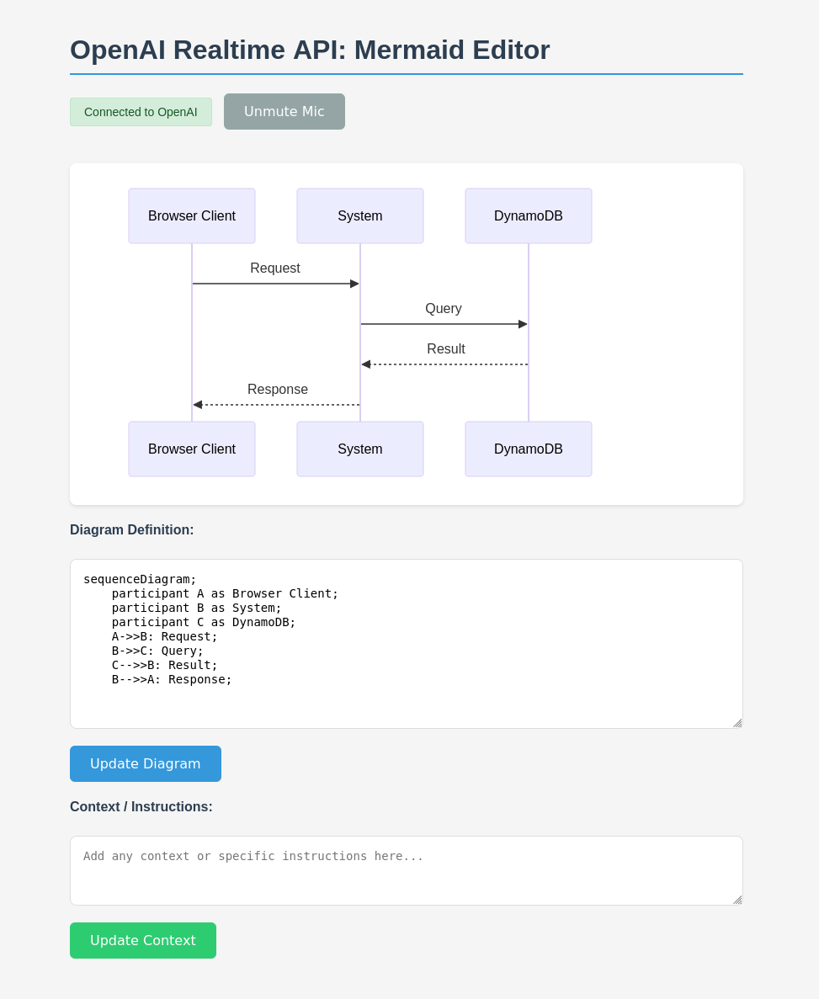
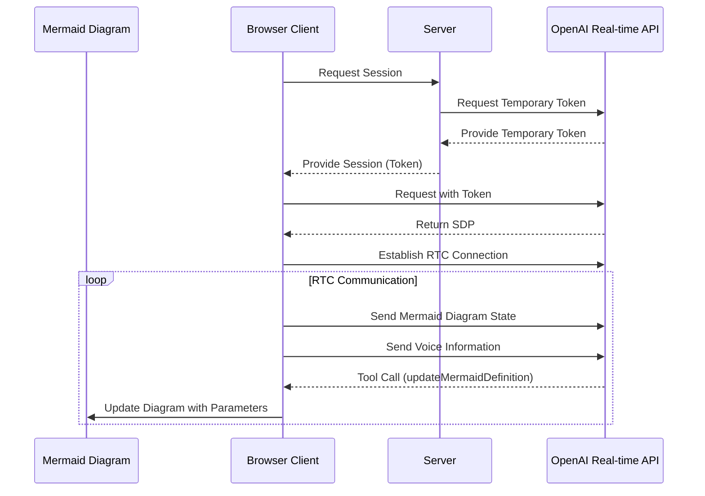

# Mermaid AI

> Use OpenAI advanced voice to create [mermaid](https://mermaid.live) diagrams.

## Install

```
go install github.com/icholy/mermaidai@latest
```

## Usage

Start the server, and open the UI in your browser: http://localhost:8000

```
mermaidai
```

**Note**: If you don't have an `OPENAI_API_KEY` environment variable, you can pass it using the `--apikey` flag.

## Screenshot



## Diagram


